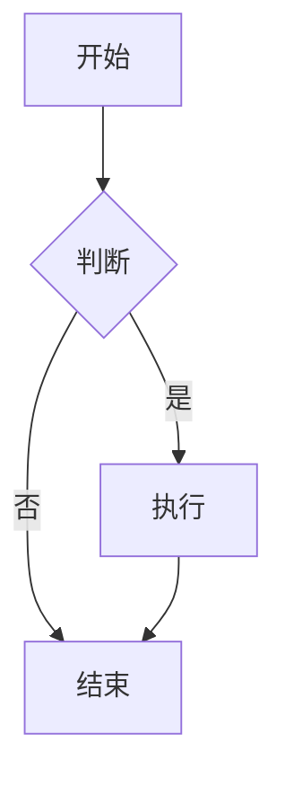

# Markdown 语法指导 Skill

当用户或 AI 需要生成可被 @ant-design/agentic-ui 的 Markdown 编辑器/渲染器正确解析的内容时，使用本技能提供准确的语法指导。

## Skill 激活场景

| 触发关键词 | 指导内容 |
|------------|----------|
| `表格`, `table` | 基础表格 + 高级表格 + 图表化表格 |
| `视频`, `video` | HTML video 标签 + 图片式视频语法 |
| `图表`, `chart`, `柱状图`, `饼图`, `折线图` | chartType 配置 + Mermaid |
| `卡片`, `card`, `link-card` | 链接卡片语法 |
| `提示块`, `alert`, `info`, `warning` | ::: 语法 |
| `Mermaid`, `流程图`, `时序图` | Mermaid 代码块 |
| `附件`, `attachment` | 附件展示语法 |
| `MDX`, `内嵌组件` | React 组件嵌入 |
| `apaasify` | aPaaS Schema 代码块 |
| `怎么写`, `语法`, `格式` | 综合语法速查 |

## 语法速查表

### 1. 表格 (Tables)

**基础 Markdown 表格**

```markdown
| 标题 1 | 标题 2 | 标题 3 |
| :----- | :----: | -----: |
| 左对齐 |  居中  | 右对齐 |
| 内容   |  内容  |   内容 |
```

**高级表格**（通过 HTML 注释启用）

```markdown
<!-- {"chartType": "table"} -->

| 姓名 | 年龄 | 职业   |
| :--- | :--- | :----- |
| 张三 | 28   | 工程师 |
| 李四 | 32   | 设计师 |
```

**将表格渲染为图表**（柱状图、饼图、折线图等）

```markdown
<!-- {"chartType": "bar", "x": "产品", "y": "销量", "title": "销量对比"} -->

| 产品 | 销量 |
| :--- | :--- |
| A    | 100  |
| B    | 150  |
| C    | 80   |
```

支持的 `chartType`：`bar`（条形）、`column`（柱状）、`line`（折线）、`area`（面积）、`pie`（饼图）、`donut`（环形）、`radar`（雷达）、`scatter`（散点）、`funnel`（漏斗）、`table`（表格）、`descriptions`（定义列表）。

---

### 2. 视频 (Video)

**方式一：HTML video 标签**

```html
<video src="https://example.com/video.mp4" controls width="400"></video>
```

带完整属性：

```html
<video src="video.mp4" controls autoplay loop muted poster="poster.jpg" width="640" height="360"></video>
```

多格式源：

```html
<video controls width="600">
  <source src="https://example.com/video.mp4" type="video/mp4">
  <source src="https://example.com/video.webm" type="video/webm">
  Your browser does not support the video tag.
</video>
```

**方式二：图片式视频语法**（扩展 Markdown，类似图片写法）

```markdown

```

> `alt` 使用 `video:自定义名称` 格式，渲染时会识别为视频并嵌入播放器。

---

### 3. 图表 (Charts)

**Mermaid 图表**

````markdown

````

支持流程图、时序图、甘特图等 Mermaid 语法。

**基于表格的数据图表**

在表格上方添加 HTML 注释配置 `chartType` 和坐标轴字段：

```markdown
<!-- {"chartType": "pie", "x": "类型", "y": "占比", "title": "类型分布"} -->
<!-- {"chartType": "line", "x": "月份", "y": "销量"} -->
<!-- {"chartType": "column", "x": "品牌", "y": "销量"} -->
<!-- {"chartType": "radar", "x": "指标", "y": "得分", "groupBy": "维度"} -->
<!-- {"chartType": "funnel", "x": "阶段", "y": "人数"} -->
```

**多图表配置**（同一表格多种展示）

```markdown
<!-- [{"chartType": "bar", "x": "产品", "y": "销量"}, {"chartType": "pie", "x": "产品", "y": "销量"}] -->

| 产品 | 销量 |
| :--- | :--- |
| A    | 100  |
| B    | 150  |
```

详细配置见 `docs/utils/chart-config.md`。

---

### 4. 卡片 (Cards)

**链接卡片**（Link Card）

格式：HTML 注释 `{"type": "card", ...}` + 紧接着的 Markdown 链接。

```markdown
<!-- {"type": "card", "icon": "https://example.com/icon.svg", "title": "卡片标题", "description": "卡片描述"} -->
[链接文本](https://example.com "悬停提示")
```

简化示例：

```markdown
<!-- {"type": "card", "title": "网易", "description": "Electronic Gaming & Multimedia"} -->
[网易](https://example.com/company/49 "公司信息")
```

> 注释必须与链接在同一段落内，且 `type` 必须为 `"card"`。

**内嵌 React 组件（MDX）**

```markdown
import { Card } from 'antd';

<Card title="卡片标题">
  卡片内容
</Card>
```

---

### 5. 提示块 (Alerts)

使用 `:::` 语法（兼容 markdown-it-container）。**注意**：`:::` 与内容之间需用空行分隔。

```markdown
:::info

这是信息提示块。

:::

:::warning

这是警告提示块。

:::

:::success

这是成功提示块。

:::

:::error

这是错误提示块。

:::
```

---

### 6. 附件 (Attachments)

```markdown

```

> `alt` 使用 `attachment:显示名称` 格式，渲染为可下载的附件链接。

---

### 7. 其他扩展

**任务列表**

```markdown
- [x] 已完成任务
- [ ] 未完成任务
```

**aPaaSify Schema 组件**

````markdown
```apaasify
{
  "type": "page",
  "body": [
    {
      "type": "button",
      "label": "点击我"
    }
  ]
}
```
````

**Agentic UI 嵌入块**（`@ant-design/agentic-ui` MarkdownEditor / MarkdownRenderer）

任务列表（渲染为 `TaskList`）：

````markdown
```agentic-ui-task
{
  "items": [
    { "key": "1", "title": "步骤", "content": "详情", "status": "loading" }
  ],
  "variant": "default"
}
```
````

用户侧工具条（渲染为 `SuggestionList`）：

````markdown
```agentic-ui-usertoolbar
{
  "items": [{ "text": "继续", "key": "go" }],
  "layout": "horizontal"
}
```
````

**3D 模型**（若项目支持）

````markdown
```model
format: glb
source: https://example.com/3d/model.glb
camera:
  position: [0, 2, 5]
  target: [0, 0, 0]
```
````

**音频**

````markdown
```audio
source: https://example.com/audio/note.mp3
title: 功能说明
```
````

---

## 指导原则

1. **优先给出可直接复制的示例**：用户通常需要「照着改」就能用。
2. **说明必须紧邻**：表格的 `chartType` 注释必须紧贴表格上方；链接卡片的注释必须与链接在同一段落。
3. **字段名与表格列一致**：`x`、`y` 等字段必须对应表格中的列名。
4. **JSON 格式严格**：HTML 注释内的 JSON 不能有尾逗号、不能有注释，否则解析失败。
5. **区分渲染环境**：MDX、apaasify 等依赖具体项目配置，需说明「若项目支持」。

## 参考文档

| 文档 | 内容 |
|------|------|
| `docs/utils/markdown-syntax.md` | 完整 Markdown 语法（中文） |
| `docs/utils/markdown-syntax.en-US.md` | 英文版语法 |
| `docs/utils/chart-config.md` | 图表配置详解 |
| `docs/demos-pages/video.md` | 视频支持说明 |

## 快速回复模板

当用户问「怎么在 Markdown 里加表格/视频/图表/卡片」时，可复用上述对应章节的示例，并附带一句说明（如「将示例中的 URL、列名换成你的数据即可」）。

## 命令行速查（可选）

如需快速获取某类语法的代码片段，可运行：

```bash
# 查看所有可用关键词
python .cursor/skills/markdown-syntax-guide/scripts/lookup.py -l

# 获取表格语法
python .cursor/skills/markdown-syntax-guide/scripts/lookup.py table.advanced

# 获取柱状图语法
python .cursor/skills/markdown-syntax-guide/scripts/lookup.py chart.bar

# 获取视频语法
python .cursor/skills/markdown-syntax-guide/scripts/lookup.py video.html
```

语法片段数据位于 `data/syntax-snippets.json`。
